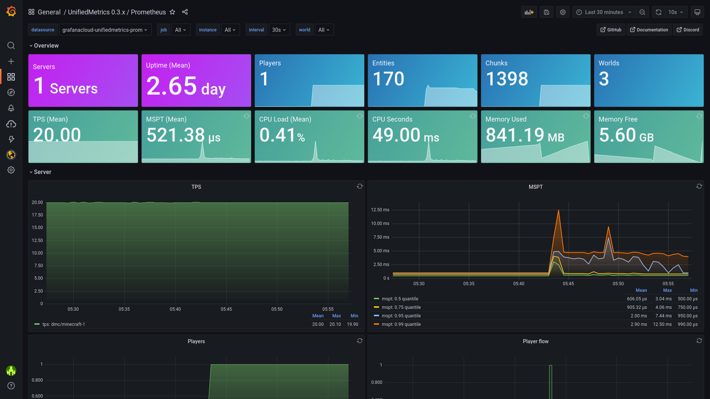

[](LICENSE)
[](https://github.com/Cubxity/UnifiedMetrics/issues)
[](https://github.com/Cubxity/UnifiedMetrics/actions)
[](https://discord.gg/kDDhqJmPpA)

UnifiedMetrics is a fully-featured free and open-source metrics collection plugin for Minecraft servers.
This project is licensed under [GNU AGPLv3](LICENSE)



## Compatbility
**Server:**
- 1.8+ Spigot servers
- Minestom (Beta)
- Velocity
- BungeeCord

**Metrics:**
- Prometheus
- InfluxDB

## Features
- Server metrics collection (TPS, MSPT, Players, Plugins)
- World metrics collection (Entities, Chunks)
- Events metrics collection (Player flow, chat, pings)
- JVM metrics collection (Memory, CPU Load, Threads, GC, Uptime)
- Extensible API (Custom metrics, samples, metrics driver) 
- More features upcoming...

## Getting started
Read the [wiki](https://github.com/Cubxity/UnifiedMetrics/wiki) for instructions.

> **NOTE:** The wiki is updated for the upcoming 0.3.x versions.

## Data visualization and analysis
We recommend using [Grafana](https://grafana.com/) as it provides highly customizable diagrams.
Grafana provides out-of-box support for Prometheus and InfluxDB.

- Add Prometheus/InfluxDB datasource to Grafana
- Import our [Prometheus dashboard](https://grafana.com/grafana/dashboards/14017) or [InfluxDB dashboard](https://grafana.com/grafana/dashboards/13860)
- Configure the dashboard and set up alerts *(optional)*

## API
Add `:unifiedmetrics-api` as a dependency (compileOnly/provided).

```kotlin
import dev.cubxity.plugins.metrics.api.UnifiedMetricsProvider

/* ... */

val api = UnifiedMetricsProvider.get()
```
